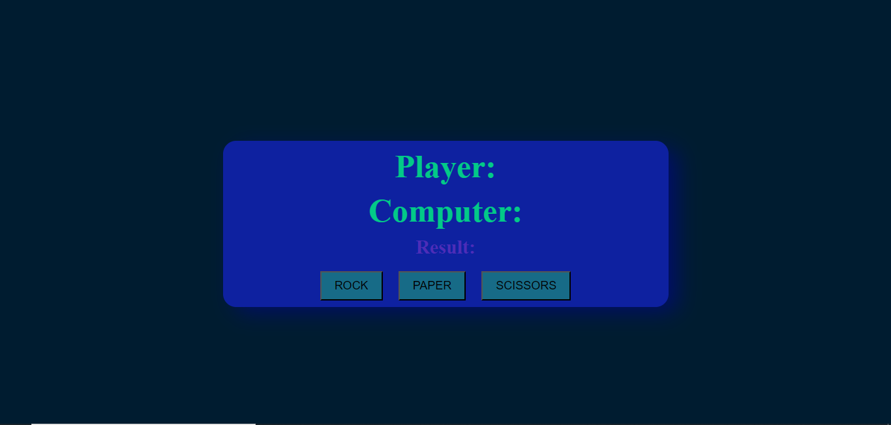

# Rock, Paper, Scissors Game

This is a simple Rock, Paper, Scissors game implemented in JavaScript. It allows you to play the classic game against the computer.
# Screenshot 

## How to Play

1. Click on one of the three options: Rock, Paper, or Scissors.

2. The computer will make its choice, and the winner will be displayed on the screen.

## Features

- Play the classic Rock, Paper, Scissors game against the computer.
- Simple and intuitive user interface.

## Technologies Used

- HTML
- CSS
- JavaScript

## Author

- [https://github.com/TanRandel)]

